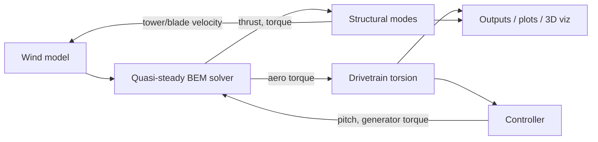

# WTG Tools — Project Overview

## Purpose

**WTG Tools** is a browser-based educational and engineering exploration app for
understanding how horizontal-axis wind turbines convert wind into electrical
power. It is built as a single page (`index.html`) with three tabs that build on
each other conceptually, going from the simplest possible physical model to a
fully coupled, time-domain aero-servo-elastic simulator:

| Tab | Question it answers | Status |
|---|---|---|
| **Induction & Betz Limit** | Why can't a turbine capture 100% of the wind's kinetic energy? | ✅ Complete |
| **BEM Method** | How does a real blade cross-section generate lift/drag, and how do those integrate into rotor thrust and torque? | ✅ Complete, interactive |
| **Full Simulator** | How does a complete turbine behave over time, with control, structural flexibility and turbulent wind? | ✅ Complete, functional |

All three tabs share the same visual language (dark theme, KaTeX-rendered
equations, canvas-based plots) and are implemented in vanilla JavaScript
(ES modules), with [Three.js](https://threejs.org/) used only for the 3D
turbine visualization in the Full Simulator tab. No build step is required —
the app runs directly from static files served over HTTP.

---

## Tab 1 — Induction & Betz Limit

A 1D actuator-disc model. The user drags the axial induction factor `a` and
sees, in real time:

- How the streamtube contracts upstream and expands downstream (mass
  conservation).
- The velocity at the disc `V(1-a)` and in the far wake `V(1-2a)`.
- The resulting `Cp(a)` and `Ct(a)` curves, with the Betz optimum
  (`a = 1/3`, `Cp,max = 16/27 ≈ 0.593`) highlighted.
- A full derivation panel (continuity → momentum → Bernoulli → Betz optimum)
  rendered with KaTeX.

This tab has no notion of blades, rotation, or airfoils — it is pure
1D momentum theory and serves as the conceptual foundation for Tab 2.

## Tab 2 — BEM Method

An interactive Blade Element Momentum (BEM) explorer built around a single
blade cross-section (based on the NREL 5 MW reference blade geometry: chord,
twist, and thickness distributions, including a circular root section).

Controls: wind speed `V∞`, rotor speed `Ω`, pitch `β`, and radial position `r`.
The canvas shows two panels:

1. **Blade overview** — the discretized blade with the selected annulus
   highlighted, plus the wind and rotation indicators.
2. **Element detail** — the airfoil profile at that radius (scaled to its real
   chord and rotated by local twist + pitch relative to the rotor plane),
   the velocity triangle (`V∞(1-a)`, `Ωr(1+a')`, and the resultant `W`), the
   inflow angle `φ`, and the resulting aerodynamic forces `dL`/`dD`, with an
   explanation of how these integrate into elemental thrust `dT` and torque
   `dQ`. A `Cp` vs `λ` performance map shows the current operating point.

This tab makes the connection between 2D airfoil aerodynamics and 1D momentum
theory explicit — it is the missing link between Tab 1 and Tab 3.

## Tab 3 — Full Simulator

See the detailed section below.

---

## Full Simulator — How the model is built

The Full Simulator (`js/simulation.js` orchestrating `js/turbine.js`,
`js/bem.js`, `js/airfoil.js`, `js/structural.js`, and `js/controller.js`) is a
**coupled, time-domain aero-servo-elastic model**. Each simulation step
advances several interacting sub-models together:



### 1. Wind model (`WindModel`)

A simple but effective hub-height wind generator combining:

- **Mean speed** (user-controlled, 3–25 m/s).
- **Vertical wind shear**, modeled with a power-law profile
  `V(z) = V_hub · (z / z_hub)^α`, so each blade experiences a different
  wind speed depending on its azimuthal position (this feeds the 1P blade
  loads described below).
- **Sinusoidal gusts** with adjustable amplitude and period.
- **Turbulence**, generated as filtered pseudo-random noise (first-order
  low-pass filter over a deterministic PRNG) scaled by turbulence intensity.

### 2. Aerodynamics — quasi-steady BEM (`bemSolve`)

At every integration step, the rotor's aerodynamic loads are recomputed from
scratch by solving the classic BEM equations over **24 blade elements**
(`NELEM = 24`), from hub to tip:

- For each element, axial and tangential induction factors (`a`, `a'`) are
  solved iteratively (fixed-point iteration with relaxation) until
  convergence, using:
  - **Prandtl tip and root loss corrections** (`Ftip`, `Fhub`) to account for
    finite blade number.
  - **Glauert/Buhl correction** for the high-thrust region (`a > 0.2`), where
    simple momentum theory breaks down.
- Local angle of attack `α = φ - twist - pitch` is computed from the inflow
  angle `φ = atan2(V(1-a), Ωr(1+a'))`.
- Lift and drag coefficients `Cl(α)`, `Cd(α)` come from an **analytical polar
  model** (`js/airfoil.js`): thin-airfoil theory in the linear range
  (`Cl = 2π(α - α₀)`), blended into a **Viterna post-stall extrapolation**
  for large angles of attack. This avoids depending on external airfoil
  tables while remaining physically reasonable and giving correct stall/deep-stall
  behavior, representative of the DU/NACA-64 airfoil family used on the
  real NREL 5 MW blade.
- Elemental normal/tangential forces are integrated along the blade to
  obtain total rotor **thrust `T`** and **torque `Q`**, plus `Cp`, `Ct`, and
  tip-speed ratio `λ`.

This BEM solve is **quasi-steady**: it assumes the flow field adapts
instantaneously to the current blade pitch, rotor speed and wind speed at
each timestep — a standard and reasonable simplification at the timescales
relevant to control and structural response.

### 3. Structural dynamics (`structural.js`)

Instead of a full finite-element / multibody model, structural flexibility is
represented using **modal superposition**: each relevant structural mode is
reduced to a single damped second-order oscillator,

```
m·ẍ + c·ẋ + k·x = F(t)   ⇔   ẍ = F/m − 2ζωₙ·ẋ − ωₙ²·x
```

Modes included (with their approximate NREL 5 MW natural frequencies):

| Mode | Frequency | Damping | Excited by |
|---|---|---|---|
| Tower fore-aft | 0.324 Hz | 1% | Rotor thrust |
| Tower side-side | 0.312 Hz | 1% | Net lateral/tangential aero force |
| Blade flap (×3) | 0.70 Hz | 0.48% | Per-blade thrust, modulated by wind shear |
| Blade edge (×3) | 1.08 Hz | 0.92% | Per-blade tangential aero force + gravity (1P) |

Each blade's flap/edge loads are modulated per-azimuth using the shear
profile and blade weight, so the model captures **1P (once-per-revolution)
periodic loading** even though the aerodynamics themselves are quasi-steady.

### 4. Drivetrain (torsional degree of freedom)

The rotor (low-speed shaft) and generator (high-speed shaft, referred back to
the LSS) are connected through a torsional spring-damper representing the
gearbox/shaft flexibility:

```
Q_shaft = K_dt·(θ_rotor − θ_gen,LSS) + C_dt·(ω_rotor − ω_gen,LSS)
```

with `K_dt ≈ 8.68×10⁸ N·m/rad` and `C_dt ≈ 6.2×10⁶ N·m·s/rad`. This allows the
rotor and generator speeds to differ slightly and oscillate relative to each
other (drivetrain torsional resonance), rather than being rigidly locked.

### 5. Control system (`controller.js`)

A classic **variable-speed, variable-pitch** control strategy with three
operating regions:

- **Region 1** (below cut-in rotor speed): no torque control action beyond
  the optimum-torque law.
- **Region 2** (partial load, below rated wind): **optimal-torque control**,
  `Q_gen = K_opt · ω_gen²`, where `K_opt` is derived analytically from the
  known `Cp,max` and optimal tip-speed ratio `λ_opt` so that the rotor is
  driven toward its most efficient operating point.
- **Region 3** (above rated wind): constant electrical power is targeted via
  torque (`Q_gen = P_rated / ω_gen`), while a **PI pitch controller** actively
  pitches the blades to regulate rotor speed at rated. The pitch PI gains use
  **gain scheduling** (`Kp`, `Ki` reduced as pitch increases) to compensate for
  the well-known nonlinear increase of aerodynamic sensitivity to pitch angle
  at higher pitch settings.
- **Emergency stop**: triggered by the user (⏹ button). Blades feather to 90°
  at the maximum pitch rate, the generator is disconnected, and a mechanical
  disc brake (Coulomb friction, applied at the high-speed shaft) brings the
  rotor to a stop once blades are sufficiently feathered.

### 6. Time integration

The full state vector (rotor azimuth/speed, generator azimuth/speed, tower
fore-aft/side-side modal states, and 3 blades × flap/edge modal states) is
advanced with a **4th-order Runge-Kutta (RK4)** integrator at a fixed step of
`dt = 0.005 s`, while aerodynamic and control loads are held constant within
each sub-step (consistent with the quasi-steady aerodynamics assumption).
The simulation can be sped up (0.25×–6×) relative to real (wall-clock) time,
and multiple integration steps are batched per animation frame to keep the
UI responsive.

### 7. Visualization and outputs

- A **Three.js** 3D scene (`visualization.js`) renders the tower, nacelle and
  rotor, animating rotor azimuth, blade pitch, and (exaggerated, for
  visibility) tower and blade deflections.
- A **canvas-based plotting system** (`plots.js`) streams time series for
  electrical/aerodynamic power, torque, rotor speed, pitch, TSR, wind speed,
  thrust, and structural deflections.
- Real-time **gauges** show wind speed, electrical power, rotor speed, pitch,
  TSR, generator torque, thrust and `Cp`.
- **Scenario buttons** jump directly to representative operating points
  (rated, partial load, full power, gust + turbulence, storm/cut-out).

---

## Turbine characteristics being simulated

The simulator uses the parameters of the **NREL 5 MW Reference Wind
Turbine** (`js/turbine.js`), a widely used public-domain research turbine
model for offshore/onshore wind studies:

| Parameter | Value |
|---|---|
| Rated power | 5.0 MW (electrical) |
| Number of blades | 3 |
| Rotor radius / diameter | 63.0 m / 126 m |
| Hub radius | 1.5 m |
| Hub height | 90.0 m |
| Shaft tilt / precone | 5.0° / 2.5° |
| Rotor + hub inertia (LSS) | 3.544×10⁷ kg·m² |
| Generator inertia (HSS) | 534.1 kg·m² |
| Gearbox ratio | 97:1 |
| Nacelle mass | 240,000 kg |
| Blade mass | 17,740 kg (each) |
| Cut-in / rated / cut-out wind speed | 3.0 / 11.4 / 25.0 m/s |
| Rated rotor speed | 12.1 rpm |
| Rated generator speed | 1173.7 rpm |
| Generator efficiency | 94.4% |
| Optimal TSR / max Cp (region 2 target) | λ = 7.55 / Cp = 0.482 |
| Max pitch rate | 8°/s |
| Air density | 1.225 kg/m³ |

The blade planform (chord and twist at 17 spanwise stations, from ~2.9 m to
~61.6 m radius) is taken directly from the published NREL 5 MW blade
definition, giving a realistic taper (chord tapering from ~3.5 m near the
root to ~1.4 m at the tip) and washout (twist decreasing from ~13.3° at the
root to ~0.1° at the tip). Structural mode frequencies (tower fore-aft/side-side,
blade flap/edge) are likewise representative of the published NREL 5 MW
structural properties, reduced to single-DOF modal oscillators rather than
full modal shapes.

---

## Current status summary

- All three tabs are implemented and functional; there are no known missing
  features or placeholder content.
- The Betz and BEM tabs are self-contained teaching tools with simplified
  or semi-analytical models (Betz: closed-form; BEM tab: NREL-based geometry
  with a simplified Gaussian `Cp(λ, β)` surface for the performance map, while
  the per-section physics — velocity triangle, forces — are computed exactly
  from the actual operating point).
- The Full Simulator uses the *actual* BEM solver (`bem.js`) coupled to
  structural, drivetrain and control models, integrated in real time with
  RK4 — this is a genuine (if simplified relative to tools like FAST/HAWC2)
  aero-servo-elastic simulation, not a lookup-table approximation.
- Three.js is loaded from a CDN via an import map, so an internet connection
  is required the first time the app loads; all other computation and
  rendering is done locally in the browser with no server-side dependency
  beyond serving static files.

## Running the app

```powershell
# From the project folder
python -m http.server 8123
```

Then open <http://localhost:8123/index.html> in a browser.
